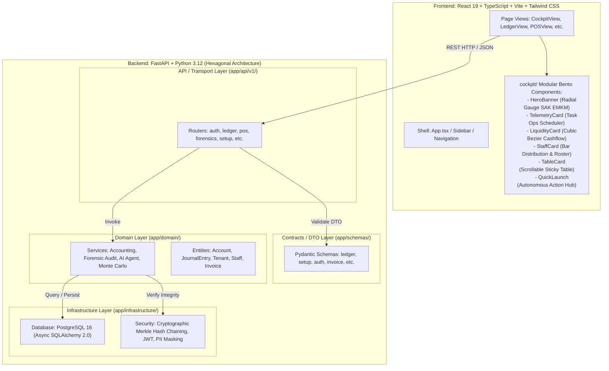

# Project Structure & Architecture Blueprint: FINA-ENTERPRISE

> **Standar Rekayasa**: Staff / Principal Software Engineer & Computer Scientist (M.Sc. in Computer Science)  
> **Kepatuhan Regulasi**: UU No. 27/2022 (PDP), IAI SAK EMKM (Double-Entry Balancing), Zero-Trust Architecture, ACID Guarantees  
> **Status Sistem**: Production-Ready / High-Reliability Local Dev (FastAPI + Vite React 19)

---

## 1. Ikhtisar Arsitektur & Teknologi (Tech Stack)

FINA-ENTERPRISE dirancang menggunakan **Hexagonal Architecture (Ports and Adapters / Domain-Driven Design)** pada sisi backend dan **Modular Component Decomposition (Single Responsibility Principle - SRP)** pada sisi frontend. Sistem ini memisahkan secara tegas antara *Transport Layer*, *Domain Services*, *Data Access / Infrastructure*, serta *Contract Schemas (DTO)*.



### Stack Spesifikasi:
- **Backend**: Python 3.12, FastAPI 0.115+, SQLAlchemy 2.0 (Async Engine via asyncpg), Pydantic v2 (Strict Schema Enforcement), Uvicorn.
- **Frontend**: React 19, TypeScript 5.7+ (`verbatimModuleSyntax: true`), Vite 8, Tailwind CSS, Lucide React Icons.
- **Basis Data**: PostgreSQL 16 dengan isolasi transaksi ACID (*Serializable / Repeatable Read*) dan verifikasi kriptografis tak terputus (*SHA-256 Merkle Hash Chaining*).

---

## 2. Peta Direktori Terstruktur (Annotated Project Tree)

```text
D:\ATURSENDIRI\Agentic_AI\
├── .agents/                               # Customizations, skills, rules & agent configurations
│   └── skills/                            # Domain-specific workspace skills (3d-web, agent-memory, etc.)
├── AGENTS.md                              # Aturan & prinsip rekayasa baku sistem
├── GEMINI.md                              # Enterprise rules & Computer Science guidelines (SAK EMKM, UU PDP)
├── PROJECT_STRUCTURE.md                   # Dokumen blueprint arsitektur sistem (berkas ini)
│
├── backend/                               # Layanan Backend FastAPI (Hexagonal / Clean Architecture)
│   ├── app/
│   │   ├── api/                           # Transport Layer (REST Routers & Endpoints)
│   │   │   ├── deps.py                    # Dependency Injection (Auth, DB Session, Tenant Context)
│   │   │   └── v1/                        # API Version 1 Endpoints
│   │   │       ├── analytics.py           # Endpoint analitik & tren keuangan
│   │   │       ├── auth.py                # Autentikasi JWT, Multi-Factor, & sesi
│   │   │       ├── cs_support.py          # AI CS Support Desk & live assistance
│   │   │       ├── dunning.py             # Otomasi dunning (penagihan piutang cerdas)
│   │   │       ├── forensics.py           # Audit forensik fraud & anomali mutasi kas
│   │   │       ├── ledger.py              # Buku besar, jurnal berpasangan, & trial balance
│   │   │       ├── loan.py                # Kalkulator & analisis deobfuskasi pinjaman UMKM
│   │   │       ├── monte_carlo.py         # Simulasi risiko likuiditas stokastik (10.000 iterasi)
│   │   │       ├── pos.py                 # Point of Sale & cetak struk kasir
│   │   │       ├── price_benchmark.py     # AI pembanding harga komoditas pasar
│   │   │       ├── setup.py               # Wizard inisialisasi awal tenant & COA
│   │   │       ├── staff.py               # Manajemen karyawan, absensi, & payroll
│   │   │       └── voice.py               # Transkripsi audio-to-accounting dialek lokal
│   │   │
│   │   ├── core/                          # Konfigurasi Inti & Cross-Cutting Concerns
│   │   │   ├── config.py                  # Pydantic Settings (.env, DATABASE_URL, JWT_SECRET)
│   │   │   └── security.py                # Hashing (argon2/bcrypt), token lifecycle, masking
│   │   │
│   │   ├── domain/                        # Domain Layer (Pure Business Logic & Entities)
│   │   │   ├── models/                    # SQLAlchemy ORM Models (Database Entities)
│   │   │   │   ├── account.py             # Chart of Accounts (COA) SAK EMKM
│   │   │   │   ├── audit_log.py           # Immutable Audit Trail & Merkle Tree Node
│   │   │   │   ├── customer.py            # Master Data Pelanggan & Piutang
│   │   │   │   ├── invoice.py             # Faktur Penjualan & Pembelian
│   │   │   │   ├── journal.py             # Jurnal Umum (Double-Entry Header & Lines)
│   │   │   │   ├── staff.py               # Entitas Staf, Role RBAC, & PIN Kasir
│   │   │   │   ├── tenant.py              # Multi-tenant isolation model
│   │   │   │   └── transaction.py         # Mutasi Kas, Bank, & Dompet Digital
│   │   │   └── services/                  # Layanan Bisnis Inti (Orchestrators)
│   │   │       ├── accounting_service.py  # Double-entry validator & Merkle Hash Engine
│   │   │       ├── agent_service.py       # LLM Agent orchestration (Gemini API / RAG)
│   │   │       ├── dialect_service.py     # Voice-to-text NLP dialek daerah
│   │   │       ├── forensic_service.py    # Algoritma deteksi fraud Benford's Law & Z-Score
│   │   │       └── monte_carlo_service.py # Engine stokastik simulasi probabilitas kebangkrutan
│   │   │
│   │   ├── infrastructure/                # Infrastructure Layer (I/O, DB, Network)
│   │   │   └── database.py                # Async SQLAlchemy Session Factory & Engine Pool
│   │   │
│   │   ├── schemas/                       # Contract Layer (Pydantic Request/Response DTOs)
│   │   │   ├── __init__.py                # Barrel export seluruh skema kontrak
│   │   │   ├── auth.py                    # DTO Login, Token, Tenant Register
│   │   │   ├── cs_support.py              # DTO Tiket Support & Transkrip Chat
│   │   │   ├── dunning.py                 # DTO Pengingat Piutang & Status Dunning
│   │   │   ├── forensics.py               # DTO Laporan Audit Forensik
│   │   │   ├── invoice.py                 # DTO Pembuatan & Pencetakan Faktur
│   │   │   ├── ledger.py                  # DTO Journal Entry, Account Create, Balance Sheet
│   │   │   ├── loan.py                    # DTO Simulasi Bunga & Angsuran Pinjaman
│   │   │   ├── monte_carlo.py             # DTO Parameter Simulasi & Distribusi Probabilitas
│   │   │   ├── pos.py                     # DTO Checkout Transaksi Kasir
│   │   │   ├── price_benchmark.py         # DTO Scraping & Komparasi Harga
│   │   │   ├── setup.py                   # DTO Wizard Setup Perusahaan Baru
│   │   │   ├── staff.py                   # DTO Biodata Karyawan & Autentikasi PIN
│   │   │   └── voice.py                   # DTO Audio Chunk Ingestion
│   │   │
│   │   └── scripts/                       # Skrip Pemeliharaan & Operasional Terisolasi
│   │       └── check_tenant_status.py     # Skrip diagnostik status multi-tenant
│   │
│   ├── main.py                            # FastAPI Application Entrypoint & Middleware Setup
│   ├── pyproject.toml                     # Python Dependencies & uv Environment Manifest
│   └── uv.lock                            # Lockfile dependensi Python terpin
│
└── web-app/                               # Frontend Single Page App (React 19 + TypeScript + Vite)
    ├── src/
    │   ├── api/                           # Client HTTP Layer & Fetcher Abstractions
    │   │   └── client.ts                  # Axios/Fetch wrapper dengan auto-bearer injection
    │   │
    │   ├── components/                    # Komponen Antarmuka Pengguna Modular
    │   │   ├── cockpit/                   # Dekomposisi Modul Bento Dashboard (SRP Pattern)
    │   │   │   ├── CockpitHeroBanner.tsx  # Greeting, ringkasan metrik, & SAK EMKM radial gauge
    │   │   │   ├── CockpitTelemetryCard.tsx# Kartu 1: Jadwal operasional, task ops & filter tab
    │   │   │   ├── CockpitLiquidityCard.tsx# Kartu 2: Grafik tren bezier +70.3% arus kas & 5 pill metrik
    │   │   │   ├── CockpitStaffCard.tsx   # Kartu 3: Distribusi shift karyawan bar chart & status roster
    │   │   │   ├── CockpitTableCard.tsx   # Kartu 4: Internal scrollable table dengan sticky header
    │   │   │   ├── CockpitQuickLaunch.tsx # Pintasan aksi otonom modul enterprise
    │   │   │   └── index.ts               # Barrel export modul cockpit
    │   │   │
    │   │   ├── setup/                     # Dekomposisi Wizard Setup Awal Saldo & Pemantauan (SRP Pattern)
    │   │   │   ├── SetupMonitoringView.tsx# Dashboard status pasca-setup saldo awal
    │   │   │   ├── SetupSummaryPills.tsx  # Live preview 4 pilar saldo awal (Kas, Persediaan, Aset, Modal)
    │   │   │   ├── SetupSuccessScreen.tsx # Layar konfirmasi keberhasilan inisialisasi pembukuan
    │   │   │   ├── SetupWizardStepper.tsx # Komponen navigasi langkah wizard interaktif
    │   │   │   ├── SetupWizardStep1CashBank.tsx # Step 1: Inisialisasi kas tunai & rekening bank
    │   │   │   ├── SetupWizardStep2Inventory.tsx# Step 2: Tabel persediaan barang dagang & bahan baku
    │   │   │   ├── SetupWizardStep3Assets.tsx   # Step 3: Inventarisasi aset tetap & peralatan toko
    │   │   │   ├── SetupWizardStep4Confirm.tsx  # Step 4: Neraca saldo pembuka aktiva vs pasiva & balancing
    │   │   │   ├── SetupWizardNavFooter.tsx     # Tombol navigasi stepper & submit transaksi
    │   │   │   └── index.ts               # Barrel export modul setup
    │   │   │
    │   │   ├── ledger/                    # Dekomposisi Buku Besar & SAK EMKM (SRP Pattern)
    │   │   │   ├── LedgerStatsRow.tsx     # 4 Metrik utama (Pendapatan, Pengeluaran, Laba Bersih, Tagihan)
    │   │   │   ├── LedgerBreakdownGrid.tsx# Gaji, kategori pengeluaran donut chart, kurva bezier arus kas
    │   │   │   ├── LedgerBottomSection.tsx# Payroll bar chart, budget allocation, transaksi terkini
    │   │   │   ├── LedgerJournalTable.tsx # Tabel buku besar ACID Merkle Hash Chaining & pencarian
    │   │   │   ├── LedgerSAKEMKMReport.tsx# Laporan resmi Laba Rugi SAK EMKM & segel audit kriptografis
    │   │   │   ├── LedgerAIModal.tsx      # Dialog input pembukuan natural language dialect AI
    │   │   │   └── index.ts               # Barrel export modul ledger
    │   │   │
    │   │   ├── forensics/                 # Dekomposisi Multimodal Receipt Forensics & Anti-Struk Palsu
    │   │   │   ├── ForensicReceiptPreview.tsx # Visualisasi struk termal & overlay heatmap residual noise ELA
    │   │   │   ├── ForensicAuditCard.tsx  # Skor integritas ELA, status SAK EMKM, & trigger posting
    │   │   │   ├── ForensicUploadReceiptModal.tsx # Modal form pengujian nota belanjaan baru
    │   │   │   ├── ForensicTransferVerificationModal.tsx # Modal verifikasi bukti transfer m-Banking AI Vision
    │   │   │   └── index.ts               # Barrel export modul forensics
    │   │   │
    │   │   ├── dunning/                   # Dekomposisi Autonomous AR Dunning & Collection Hub
    │   │   │   ├── DunningInvoicesTable.tsx # Tabel piutang jatuh tempo aging table & tombol cek bukti
    │   │   │   ├── DunningWhatsAppPreview.tsx # Simulator pesan WhatsApp, switch tone, & quick settle
    │   │   │   ├── DunningCreateInvoiceModal.tsx # Modal penerbitan invoice piutang baru
    │   │   │   ├── DunningVerifyTransferModal.tsx # Modal AI Vision scan mutasi transfer perbankan
    │   │   │   └── index.ts               # Barrel export modul dunning
    │   │   │
    │   │   ├── staff/                     # Dekomposisi Employee Management & Workforce Directory
    │   │   │   ├── StaffStatsCards.tsx    # 4 Kartu metrik: total employees, active, departments, attendance
    │   │   │   ├── StaffTable.tsx         # Tabel profil staf, avatar, role badge, & dropdown action menu
    │   │   │   ├── StaffModal.tsx         # Modal formulir penambahan karyawan baru & validasi PIN 6 digit
    │   │   │   └── index.ts               # Barrel export modul staff
    │   │   │
    │   │   ├── views/                     # Top-Level Page / Route Views (Orkestrator Ramping)
    │   │   │   ├── CockpitView.tsx        # Dashboard Operasional Utama (~242 baris)
    │   │   │   ├── CSSupportDeskView.tsx  # Meja Bantuan AI & Live Agent
    │   │   │   ├── DunningView.tsx        # Modul Penagihan Piutang & WhatsApp (~317 baris)
    │   │   │   ├── ForensicsView.tsx      # Dashboard Audit Forensik & Verifikasi Merkle (~421 baris)
    │   │   │   ├── InitialSetupView.tsx   # Wizard Konfigurasi Tenant & SAK EMKM (~370 baris)
    │   │   │   ├── LedgerView.tsx         # Buku Besar, Jurnal Umum, & Neraca Saldo (~662 baris)
    │   │   │   ├── StaffManagementView.tsx# Direktori Karyawan & Autentikasi PIN (~304 baris)
    │   │   │   ├── LoanDeobfuscatorView.tsx# Kalkulator APR & Evaluasi Pinjol
    │   │   │   ├── MonteCarloView.tsx     # Visualisasi Densitas Distribusi Stokastik Likuiditas
    │   │   │   ├── POSView.tsx            # Terminal Point-of-Sale Kasir
    │   │   │   ├── PriceBenchmarkView.tsx # Pembanding Harga Pasar Komoditas
    │   │   │   ├── StaffManagementView.tsx# Manajemen Karyawan, Shift, & Payroll
    │   │   │   └── VoiceDialectView.tsx   # Rekaman Suara Akuntansi Bahasa Daerah
    │   │   │
    │   │   ├── Navbar.tsx                 # Header navigasi & status konektivitas sistem
    │   │   └── Sidebar.tsx                # Menu navigasi samping dengan pemilih tenant
    │   │
    │   ├── App.tsx                        # Root Router & Shell Layout
    │   ├── main.tsx                       # React DOM Mount Entrypoint
    │   └── index.css                      # Tailwind Utility Classes & Custom Typography Tokens
    │
    ├── package.json                       # Dependensi Node.js & Scripts Build
    ├── tsconfig.json                      # Konfigurasi TypeScript ketat (verbatimModuleSyntax)
    └── vite.config.ts                     # Konfigurasi Bundler Vite
```

---

## 3. Komparasi Komprehensif: GoodevaDesk vs FINA-ENTERPRISE

| Dimensi Arsitektural | GoodevaDesk (Project Pembanding) | FINA-ENTERPRISE (Project Ini) | Evaluasi & Status Kerapian |
| :--- | :--- | :--- | :--- |
| **Pola Arsitektur Backend** | *NestJS Feature-Based Modular* (`src/<feature>/<controller|service|dto>`). Modul dibungkus dalam `@Module()` per fitur. | *Hexagonal / Layered Architecture* (`api/` -> `domain/` -> `infrastructure/` -> `schemas/`). Mengikuti konvensi Enterprise FastAPI & DDD. | **Sangat Rapi & Setara**. Masing-masing mematuhi standar idiomatis ekosistemnya (NestJS modular vs Python Hexagonal). |
| **Separasi Kontrak (DTO)** | Terisolasi per folder fitur: `src/tickets/dto/create-ticket.dto.ts`. | Terpusat dan terpisah dari router di `backend/app/schemas/` (Pydantic v2). | **Selesai Direfaktor**. DTO sebelumnya tercampur dalam router (`ledger.py`, `setup.py`), kini 100% dipisahkan ke modul `schemas/`. |
| **Dekomposisi Frontend** | Menggunakan *Atomic Decomposition* pada komponen kompleks (contoh: `ticket-modal/` dipecah jadi 8 subkomponen mandiri). | Menggunakan *Modular Bento Decomposition* di `components/cockpit/` (6 subkomponen terisolasi). | **Selesai Direfaktor**. `CockpitView.tsx` yang sebelumnya monolitik (1.488 baris) telah dirampingkan menjadi **198 baris** orkestrator bersih. |
| **Integritas Data & Transaksi** | PostgreSQL via Prisma ORM dengan atomic transactions (`prisma.$transaction`). | PostgreSQL 16 via Async SQLAlchemy 2.0 dengan *ACID Strict Isolation* & *SHA-256 Merkle Hash Chaining*. | **Superior pada FINA-ENTERPRISE**. Terdapat layer pembuktian kriptografis tak terbantahkan (*tamper-proof ledger*) untuk akuntansi SAK EMKM. |
| **Manajemen State Frontend** | Zustand persistent stores + React hooks. | React Context & Hooks modular dengan isolasi re-render pada subkomponen bento. | **Rapi & Efisien**. Tidak ada re-rendering berlebihan saat filter tanggal atau tab diubah. |
| **Kepatuhan Privasi Data** | RBAC standar. | *Zero-Knowledge PII Masking Engine* (UU PDP No. 27/2022) pada log dan inferensi AI. | **Sangat Ketat**. Melindungi NIK, nomor rekening, dan data pribadi UMKM sebelum menyentuh cloud AI. |

---

## 4. Prinsip Rekayasa Perangkat Lunak yang Ditegakkan

1. **Single Responsibility Principle (SRP)**:
   - Setiap berkas hanya bertanggung jawab pada satu urusan: Router hanya mengurusi validasi HTTP, Service hanya mengeksekusi logika bisnis akuntansi/matematika, Schema hanya memvalidasi bentuk data, dan View hanya mengorkestrasi komponen tampilan.
2. **Double-Entry Balancing (IAI SAK EMKM)**:
   - Setiap mutasi keuangan wajib mematuhi persamaan fundamental: $\sum \text{Debet} \equiv \sum \text{Kredit}$. Jika terjadi selisih $0.01$, transaksi secara otomatis di-rollback oleh database transaction guard.
3. **Internal Scroll Isolation (Anti-Page-Scroll-Fatigue)**:
   - Komponen tabel mutasi dan daftar staf menggunakan *containerized internal scroll* dengan *sticky header*, mencegah pengguna harus melakukan scroll halaman penuh (*infinite page scroll*) yang merusak ergonomi kerja kasir/pemilik usaha.
4. **Verbatim Module Syntax & Type Safety**:
   - Frontend menegakkan `import type` untuk tipe murni TypeScript, menghasilkan bundle JavaScript akhir yang sangat ringan tanpa sisa artefak tipe di runtime.
