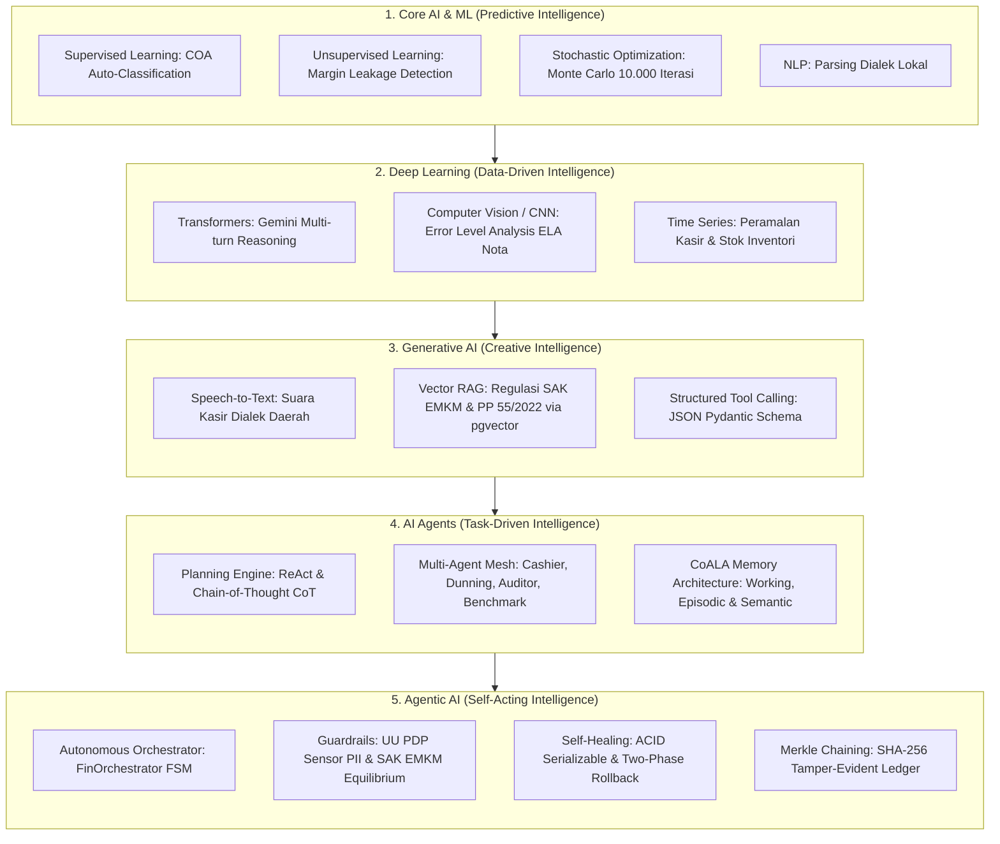

# FINA-ENTERPRISE: Autonomous Agentic AI Financial & Store Management System

<div align="center">


<p align="center">
  <b>Sistem Enterprise Otonom Berbasis Multi-Agent AI untuk Pemilik Usaha Kecil & Menengah (UMKM).</b><br>
  <i>Menyatukan Terminal Kasir Cepat (POS), Pembukuan Double-Entry Otomatis SAK EMKM, Integritas Kriptografis SHA-256 Merkle Ledger, Forensik Nota ELA, Intelijen Harga B2B, dan Penagihan Piutang WhatsApp Berlink QRIS SNAP.</i>
</p>

</div>

---

## 📑 Daftar Isi
1. [Filosofi & Latar Belakang Masalah](#1-filosofi--latar-belakang-masalah)
2. [Arsitektur Teknologi Agentic AI (5-Layer Model)](#2-arsitektur-teknologi-agentic-ai-5-layer-model)
3. [Daftar Modul & Fitur Unggulan](#3-daftar-modul--fitur-unggulan)
4. [Tata Kelola Keamanan & Kepatuhan Regulasi](#4-tata-kelola-keamanan--kepatuhan-regulasi)
5. [Struktur Direktori Repositori](#5-struktur-direktori-repositori)
6. [Panduan Instalasi & Menjalankan di Lokal](#6-panduan-instalasi--menjalankan-di-lokal)
7. [Pengujian & Verifikasi Mutu Kode](#7-pengujian--verifikasi-mutu-kode)
8. [Kontributor & Lisensi](#8-kontributor--lisensi)

---

## 1. Filosofi & Latar Belakang Masalah

Berdasarkan studi empiris pada ekosistem ritel dan F&B UMKM di Indonesia, lebih dari **60% unit usaha mengalami insolvensi kas (*cash-flow bankruptcy*) dalam 1–3 tahun pertama**. Penyebab utamanya bukanlah rendahnya penjualan, melainkan masalah sistemik:
- **Blind Unit Pricing**: Penetapan harga menu/produk berdasarkan intuisi tanpa menghitung HPP riil per gram/pcs dan alokasi *utility overhead*.
- **Margin Leakage (Kebocoran Margin)**: Kenaikan harga bahan baku grosir (beras, minyak, telur) tidak terdeteksi secara dini, menggerus laba kotor toko.
- **Pencampuran Kas Kasir & Modal Usaha**: Uang tunai di laci kasir diambil untuk keperluan pribadi tanpa pencatatan berpasangan (*double-entry balancing*).
- **Kekeliruan Omzet vs Laba Bersih**: Menyamakan omzet kotor sebagai keuntungan, melupakan kewajiban pajak PPh Final PP 55 (0,5%) dan biaya operasional tetap (*OPEX*).

**FINA-ENTERPRISE** dikembangkan dengan standar **Staff / Principal Software Engineer & Computer Scientist (M.Sc. in Computer Science)** untuk mentransformasikan UMKM dari pembukuan manual menjadi **Perusahaan Terstruktur Berbasis Agentic AI**.

---

## 2. Arsitektur Teknologi Agentic AI (5-Layer Model)

Sistem ini dirancang mengikuti evolusi 5 lapisan konsentris teknologi AI:



### Ekosistem Multi-Agent:
1. **Cashier POS Agent**: Mengelola alur kasir, memotong stok fisik riil, dan otomatis membuat jurnal akuntansi berpasangan.
2. **Forensic Vision Auditor Agent**: Memeriksa nota belanja bahan baku dan mendeteksi pemalsuan struk fisik dengan teknik *Error Level Analysis* (ELA).
3. **B2B Commodity Benchmark Agent**: Mengaudit harga penawaran supplier dengan membandingkannya terhadap harga acuan pangan nasional Bapanas/PIHPS.
4. **AR Dunning Agent**: Menjadwalkan pesan penagihan sopan via WhatsApp secara otonom berbekal tautan dinamis QRIS SNAP.
5. **Anti-Predatory Loan Agent**: Membedah kontrak pinjaman fintech/pinjol, menghitung APR efektif riil vs bunga harian yang dikaburkan.
6. **FinOrchestrator Daemon**: Mengawasi arus kas menganggur (*idle cash*) dan mengeksekusi *sweeping* otomatis ke instrumen pasar uang berimbal hasil aman.

---

## 3. Daftar Modul & Fitur Unggulan

| Modul | Deskripsi Fungsional | Standar Teknologi |
| :--- | :--- | :--- |
| 🖥️ **Terminal Kasir POS** | Kasir berkecepatan tinggi (<100ms), 9 produk katalog aktif, kalkulasi PPh Final 0,5%, pembayaran Tunai & QRIS, cetak struk termal 80mm. | React 19, TypeScript, PostgreSQL ACID |
| 📊 **Time & Shift Matrix** | Pemantauan presensi tim kerja, matriks jadwal shift, histori check-in/out, pengajuan cuti, dan jam lembur. | Bento Grid UI, Radian SVG Matrix |
| 🧭 **Executive Cockpit** | Dashboard kendali pemilik usaha dengan *Semicircular Radial Gauge* (Indeks Kesehatan Finansial SAK EMKM 80%), metrik Runway, dan sakelar data staf/transaksi. | Geometri Radian 270°, SVG Bezier Curves |
| 📖 **Buku Besar SAK EMKM** | Buku besar double-entry balance ($\sum \text{Debet} \equiv \sum \text{Kredit}$), Laba/Rugi, Neraca, dan verifikasi hash rantai Merkle tak terputus. | IAI SAK EMKM, SHA-256 Merkle Ledger |
| 🔍 **Forensik Nota (Vision)** | Pemindaian kuitansi belanja dengan deteksi manipulasi piksel, ekstraksi item belanja, dan posting instan ke beban modal. | Error Level Analysis (ELA), OpenCV, Gemini Vision |
| 🌾 **Benchmark B2B** | Deteksi *margin leakage* terhadap harga beras, telur, minyak goreng, dan daging ayam dari database komoditas nasional. | Cosine Vector Similarity, Outlier Isolation |
| 📱 **Penagihan WhatsApp** | Manajemen piutang, pelacakan umur tagihan (Aging AR), dan bot penagihan WhatsApp terintegrasi pembayaran QRIS. | Meta Cloud API / Baileys Gateway, QRIS SNAP |
| 🛡️ **Anti-Pinjol Predatory** | Dekonstruksi biaya tersembunyi, biaya admin muka (*upfront fee*), dan komparasi dengan KUR perbankan legal OJK. | Formula Anuitas Finansial & Effective APR |
| 🎙️ **Dialek Suara Daerah** | Input transaksi akuntansi menggunakan suara dialek Jawa, Sunda, Batak, Minang, dan Melayu. | Gemini Live API, Whisper ASR, Fast Lexicon Map |
| 🎲 **Simulasi Monte Carlo** | Proyeksi ketahanan kas operasional (*Cash Runway*) dalam 10.000 skenario stokastik untuk mitigasi kebangkrutan. | Algoritma Stokastik NumPy, Distribusi Normal |

---

## 4. Tata Kelola Keamanan & Kepatuhan Regulasi

### A. Kepatuhan Hukum & Standar Formal
- **UU No. 27/2022 (Perlindungan Data Pribadi / PDP)**: Menerapkan *Zero-Knowledge PII Masking Engine* yang menyensor nomor telepon (`0812-4999-****`), NIK, dan nomor rekening perbankan sebelum menyentuh model AI inferensi publik atau penyimpanan vektor.
- **PP No. 55/2022**: Kalkulasi otomatis tarif Pajak Penghasilan (PPh) Final 0,5% untuk omzet bruto UMKM.
- **Standar Akuntansi Keuangan EMKM (IAI SAK EMKM)**: Seluruh jurnal pembukuan wajib mematuhi aturan berpasangan:
  $$\sum \text{Debet} \equiv \sum \text{Kredit}$$

### B. Segregation of Duties (SoD) & RBAC Policy
Sistem menerapkan isolasi peran ketat berbasis token JWT:
- **`CASHIER` (Kasir Toko)**: Hanya dapat mengakses antarmuka POS kasir, input uang pelanggan, dan cetak struk. Terisolasi total dari HPP, modal usaha, dan saldo rekening bank pemilik.
- **`MANAGER` (Supervisor)**: Berhak mengelola inventori, stok opname, dan verifikasi nota belanja operasional.
- **`OWNER` (Direksi / Pemilik Usaha)**: Akses tanpa batas ke seluruh analitik Cockpit, simulasi Monte Carlo, audit Merkle Ledger, dan manajemen staf.

---

## 5. Struktur Direktori Repositori

```text
FINA-ENTERPRISE/
├── backend/                        # Backend Services (FastAPI + Python 3.11+)
│   ├── alembic/                    # Database Schema Migrations
│   ├── app/
│   │   ├── api/v1/                 # REST API Router Endpoints (Auth, POS, Ledger, etc.)
│   │   ├── core/                   # Security, JWT, Argon2id, App Config
│   │   ├── domain/
│   │   │   ├── models/             # SQLAlchemy ORM Models (Product, Voucher, User)
│   │   │   ├── rules/              # Business Logic & Validation Rules
│   │   │   └── services/           # SAK EMKM Accounting Service, Merkle Engine
│   │   └── infrastructure/         # PostgreSQL Connection Pool, Seed Scripts
│   ├── tests/                      # Unit & Cryptographic Integrity Tests
│   └── main.py                     # Entry Point Aplikasi Backend
├── web-app/                        # Frontend Application (React 19 + TypeScript + Vite)
│   ├── src/
│   │   ├── components/             # Reusable UI, Bento Cards, POS Panels, Header
│   │   ├── components/views/       # Views (Cockpit, POS, Ledger, Staff, Forensics)
│   │   ├── services/               # Hexagonal Modular API Clients
│   │   ├── types/                  # Strict TypeScript Interfaces & Enums
│   │   └── utils/                  # Formatters, Currency, Zero-Knowledge PII Masking
│   ├── index.html
│   └── vite.config.ts
├── project-plan/                   # Master Blueprints & Architecture Documentation
├── run_local.ps1                   # Skrip Otomatis Eksekusi Lokal Windows PowerShell
└── .gitignore                      # Konfigurasi Kebersihan Repositori (Google Standards)
```

---

## 6. Panduan Instalasi & Menjalankan di Lokal

### Prasyarat Sistem:
- **Node.js**: v20.x atau lebih baru
- **Python**: v3.11 atau v3.12
- **PostgreSQL**: v16.x dengan ekstensi `pgvector`
- **Git**

### Opsi A: Menggunakan Skrip Otomatis (Direkomendasikan)
Cukup jalankan script powershell yang telah disediakan pada root direktori:
```powershell
.\run_local.ps1
```
Skrip ini akan secara otomatis:
1. Memvalidasi ketersediaan PostgreSQL 16 pada port `5432`.
2. Menyiapkan virtual environment Python (`.venv`) dan menginstal seluruh dependensi backend.
3. Menjalankan migrasi skema tabel database dan seeding data awal 9 produk kasir.
4. Menjalankan server backend FastAPI pada `http://127.0.0.1:8000`.
5. Mengompilasi paket frontend dan menjalankan dev server Vite pada `http://localhost:5173`.

---

### Opsi B: Instalasi Manual Langkah-demi-Langkah

#### 1. Setup Backend:
```bash
cd backend
python -m venv .venv
# Windows:
.venv\Scripts\activate
# Linux/macOS:
source .venv/bin/activate

pip install -r requirements.txt
python app/infrastructure/init_db.py
uvicorn main:app --host 127.0.0.1 --port 8000 --reload
```

#### 2. Setup Frontend:
```bash
cd ../web-app
npm install
npm run dev
```
Buka browser Anda dan akses: `http://localhost:5173`

---

## 7. Pengujian & Verifikasi Mutu Kode

### Pengujian Backend:
```bash
cd backend
pytest tests/ -v
```
Memverifikasi:
- Uji konsistensi transaksi ACID dan *double-entry balance* ($\sum \text{Debit} - \sum \text{Kredit} = 0$).
- Integritas rantai hash kriptografi SHA-256 Merkle Ledger.
- Pencegahan akses unauthorized peran kasir pada endpoint sensitif.

### Pengujian Frontend:
```bash
cd web-app
npm run build
```
Memverifikasi:
- Kompilasi tipe ketat TypeScript (`tsc -b`).
- Keberhasilan bundler Vite (Zero TypeScript / Syntax Errors).

---

## 8. Kontributor & Lisensi

- **Lead Architect & Developer**: [andrian maulana](https://github.com/AndreanMlna)
- **Repositori**: [GitHub - AndreanMlna/Fina_Enterprise](https://github.com/AndreanMlna/Fina_Enterprise.git)
- **Lisensi**: Hak Cipta Terpelihara (Proprietary & Confidential - FINA Enterprise Architecture).
