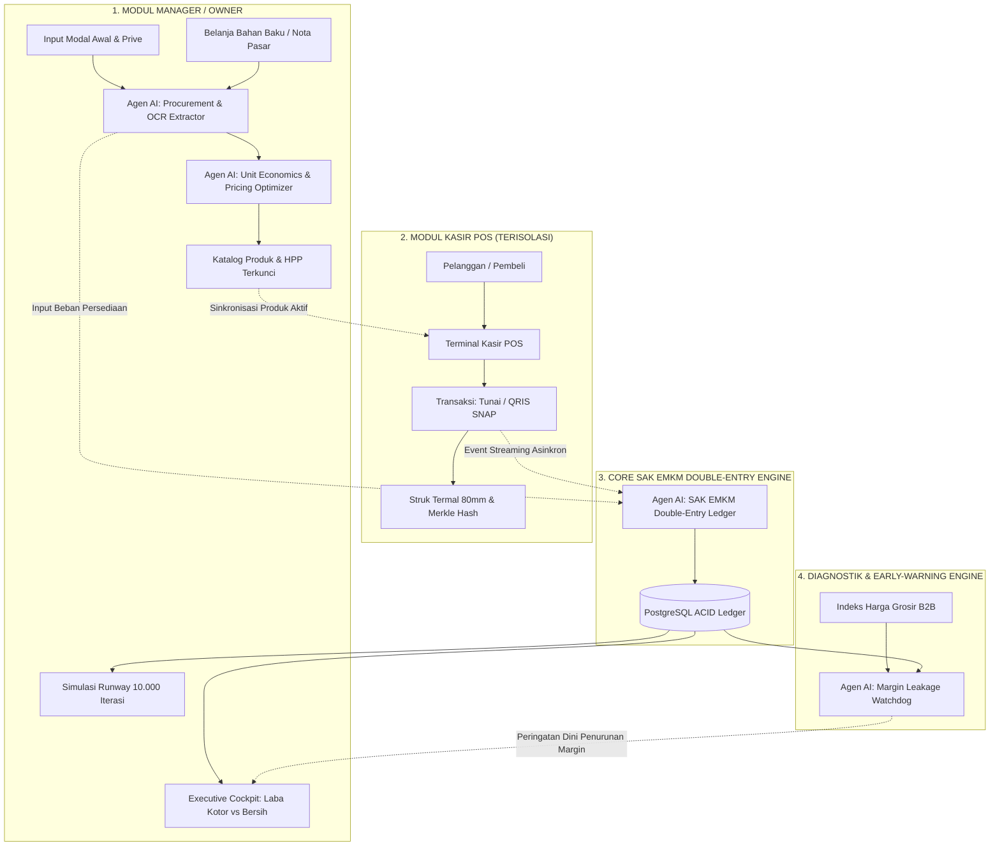

# PANDUAN ARSITEKTUR & ALUR OPERASIONAL ENTERPRISE
## FINA-ENTERPRISE: Autonomous Agentic AI Financial & Operating System

> **Standar Rekayasa & Keilmuan**:  
> Dokumen ini disusun dengan standar **Staff / Principal Software Engineer & Computer Scientist (M.Sc. in Computer Science)**, berakar pada *first principles of computer science*, prinsip dasar akuntansi keuangan (**IAI SAK EMKM**), regulasi perpajakan UMKM (**PP No. 55/2022**), hukum perlindungan data (**UU No. 27/2022 PDP**), serta standar keamanan siber internasional (**ISO 27001 & OWASP Top 10**).

---

## 1. Latar Belakang Masalah & Filosofi Desain

Berdasarkan studi empiris pada ekosistem UMKM Indonesia, lebih dari **60% unit usaha mengalami insolvensi kas (*cash-flow bankruptcy*) dalam 1–3 tahun pertama**. Penyebab utamanya bukanlah ketiadaan pasar atau rendahnya volume penjualan, melainkan fenomena sistemik:
1. **Blind Unit Pricing**: Penetapan harga jual per pcs/porsi dilakukan berdasarkan intuisi atau meniru kompetitor, tanpa membedakan antara harga bahan baku mentah, bahan penolong (kemasan, minyak, bumbu), dan alokasi overhead (gas, listrik, penyusutan alat).
2. **Margin Leakage (Kebocoran Margin)**: Kenaikan harga komoditas grosir (seperti beras, telur, minyak) tidak terdeteksi secara dini, sehingga pemilik usaha mengira mereka untung padahal margin kotornya tergerus habis.
3. **Pencampuran Kas Kasir & Modal Usaha**: Uang tunai di laci kasir seringkali langsung diambil untuk belanja operasional pribadi atau bahan tanpa pencatatan berpasangan (*double-entry*), mengakibatkan saldo modal awal terdistorsi.
4. **Kekeliruan Laba Kotor vs Laba Bersih**: Pemilik usaha menyamakan "Omzet Kasir" atau "Laba Kotor" sebagai keuntungan nyata, tanpa memperhitungkan biaya operasional tetap (*OPEX*) seperti sewa tempat, gaji karyawan, dan pajak final PP 55 (0.5%).

**FINA-ENTERPRISE** hadir untuk mentransformasikan UMKM dari pembukuan manual/MVP coba-coba menjadi **Perusahaan Terstruktur Berbasis Agentic AI**.

---

## 2. Pemisahan Peran & Tata Kelola Keamanan (RBAC & Segregation of Duties)

### 2.1 Mengapa Kasir Wajib Dilarang Mengakses Fitur Manager?

Dalam audit sistem informasi dan tata kelola korporat (**COSO Internal Control Framework & ISO 27001**), prinsip **Pemisahan Tugas (*Segregation of Duties - SoD*)** dan **Hak Akses Terkecil (*Principle of Least Privilege - PoLP*)** adalah hukum mutlak:

| Aspek Pertimbangan | Fitur Manager / Owner | Fitur Kasir Toko (Point of Sale) |
| :--- | :--- | :--- |
| **Tujuan Utama** | Pengambilan keputusan strategis, analisis modal, optimasi margin, dan audit kepatuhan SAK EMKM. | Kecepatan pelayanan transaksi kasir, akurasi penerimaan pembayaran (Tunai/QRIS), dan pencetakan struk. |
| **Akses Data Sensitif** | Saldo rekening bank, laba bersih perusahaan, rahasia resep/HPP modal per produk, data supplier, parameter Monte Carlo. | Katalog produk jual aktif, harga jual final, stok fisik toko, dan input nominal uang pelanggan. |
| **Risiko Jika Tercampur** | Pemilik usaha kehilangan kontrol strategis; laporan keuangan bias akibat kesalahan input kasir. | **Fraud & Kebocoran Rahasia Dagang**: Kasir mengetahui margin keuntungan toko, risiko manipulasi harga modal, atau pencurian stok. |
| **Karakteristik Antarmuka** | Analitik kaya data, grafik visual, tabel dekomposisi biaya, simulasi skenario. | Layar sentuh cepat (*high-throughput terminal*), tombol besar, minim distraksi, responsif < 100ms. |

---

### 2.2 Mekanisme Penegakan Isolasi Keamanan (3-Tier Security Guard)

Pemisahan peran ini ditegakkan secara berlapis (*Defense-in-Depth*):

```
                        [ DIAGRAM TATA KELOLA AKSES MULTI-ROLE ]

     [ Pengguna Masuk via WhatsApp & PIN ]
                       │
                       ▼
        [ Verifikasi Kredensial JWT ]
                       │
         ┌─────────────┴─────────────┐
         ▼                           ▼
  [ Role: CASHIER ]           [ Role: OWNER / MANAGER ]
         │                           │
         ├─────────────────────┐     ├─────────────────────────────────────────┐
         ▼                     ▼     ▼                                         ▼
  [ Frontend UI: ]      [ Backend API: ]   [ Frontend UI: ]             [ Backend API: ]
  Hanya Tampil POS      Akses Ditolak      Akses Penuh:                 Akses Penuh:
  Layar Penuh           (403 Forbidden)    • Executive Cockpit          (200 OK)
  (Sidebar Terkunci)    ke /ledger, /kpi,  • Unit Economics & Modal     ke Seluruh Endpoint
                        /procurement, dll  • Semantic Ledger & SAK EMKM Termasuk Admin
```

1. **Database Level (PostgreSQL 16)**:
   - Tabel `user_credentials` menyimpan kolom `role` dengan tipe enum: `'OWNER'`, `'MANAGER'`, `'CASHIER'`, `'AUDITOR'`.
   - Kolom `tenant_id` mengisolasi data secara horizontal sehingga kasir tenant A tidak dapat melihat katalog tenant B.
2. **Backend API Level (FastAPI Route Guards)**:
   - Setiap endpoint finansial sensitif diproteksi dengan *Dependency Injection Guard*:
     ```python
     # Hanya dapat diakses oleh Pemilik atau Manajer Usaha
     @router.post("/procurement/expense", dependencies=[Depends(require_role(["OWNER", "MANAGER"]))])
     async def record_procurement(...): ...
     ```
   - Token kasir yang mencoba menembus endpoint analitik modal otomatis diputus dengan respon `HTTP 403 Forbidden` lengkap dengan log audit keamanan OpenTelemetry.
3. **Frontend Client Level (React / TypeScript)**:
   - Router mendeteksi klaim role pada JWT. Jika pengguna berstatus `CASHIER`, sidebar modul eksekutif di-unmount dan tampilan kasir POS otomatis berjalan dalam mode *Dedicated POS Workspace*.

---

## 3. Formulasi Matematis & Keilmuan Akuntansi (First Principles)

Sistem ini tidak menggunakan estimasi kasar, melainkan kalkulasi deterministik berbasis sains akuntansi biaya (*Cost Accounting*):

### 3.1 Dekomposisi Modal & Biaya Bahan (COGS / HPP)
Harga Pokok Penjualan per unit produk dihitung secara bertingkat:
$$\text{COGS}_{\text{unit}} = \text{Raw Material Cost} + \text{Packaging Cost} + \text{Direct Utility Allocation} + \text{Waste Factor}$$

Di mana:
- **Raw Material Cost**: Biaya bahan mentah utama per porsi (misal beras, ayam, telur).
- **Packaging Cost**: Biaya bungkus, kardus, kantong, sendok plastik.
- **Direct Utility Allocation**: Alokasi konsumsi gas, listrik, dan air per siklus produksi.
- **Waste Factor ($W_f$)**: Toleransi bahan susut/rusak selama persiapan (default: $3\% - 5\%$).

$$\text{COGS}_{\text{unit}} = \left( \sum_{i=1}^{n} \frac{\text{Harga Beli Bahan}_i \times \text{Volume Digunakan}_i}{\text{Total Porsi Dihasilkan}} \right) \times (1 + W_f) + \text{Kemasan}$$

---

### 3.2 Formulasi Penetapan Harga Jual Optimal (*Gross Margin Target Pricing*)
Agar pemilik usaha terbebas dari jebakan harga rugi, sistem menghitung batas harga bawah (*Price Floor*) berdasarkan target margin laba kotor:

$$\text{Harga Jual Minimum} = \frac{\text{COGS}_{\text{unit}}}{1 - \text{Target Gross Margin } \%}$$

*Contoh Kasus Riil*:
- Jika total bahan baku + kemasan per porsi adalah $\text{Rp } 6.000$.
- Pemilik usaha menghendaki margin kotor $40\%$ untuk menutup biaya sewa ruko dan gaji karyawan:
$$\text{Harga Jual} = \frac{6.000}{1 - 0.40} = \frac{6.000}{0.60} = \text{Rp } 10.000$$

---

### 3.3 Formulasi Laba Kotor vs Laba Bersih Riil (SAK EMKM)

Dua tingkatan laba dihitung secara terpisah tanpa manipulasi:

1. **Laba Kotor (*Gross Profit*)**:
   $$\text{Laba Kotor} = \text{Omzet Penjualan (Input Kasir)} - \text{Total COGS Terjual}$$
   *Tolak ukur: Menguji efisiensi dapur, produksi, dan belanja bahan.*

2. **Laba Bersih (*Net Profit*)**:
   $$\text{Laba Bersih} = \text{Laba Kotor} - \text{Total OPEX} - \text{Pajak Final PP 55 (0.5\%) }$$
   Di mana:
   - $\text{OPEX}$ = Beban Gaji Karyawan + Sewa Tempat + Beban Listrik/Air/Internet + Beban Pemasaran.
   - $\text{Pajak PP 55}$ = $0.005 \times \text{Omzet Penjualan Bruto}$.
   *Tolak ukur: Uang nyata yang dapat ditarik sebagai dividen oleh pemilik usaha.*

---

### 3.4 Analisis Titik Impas (*Break-Even Point - BEP*)
Sistem menghitung berapa pcs/porsi minimal yang wajib terjual setiap bulan agar usaha tidak merugi:
$$\text{BEP}_{\text{unit}} = \frac{\text{Total Biaya Operasional Tetap Bulanan (OPEX)}}{\text{Harga Jual per Unit} - \text{COGS per Unit}}$$

---

## 4. Arsitektur Komprehensif Agentic AI (FinOrchestrator)

Sistem mengorkestrasi 4 Agen Cerdas Spesialis:



### Rincian Peran Agen Finansial Otonom:

1. **Agen AI: Procurement & OCR Recipe Extractor**:
   - Mampu membaca foto nota belanjaan pasar tradisional (menggunakan Vision AI) atau transkrip suara WhatsApp dalam dialek lokal.
   - Mengekstrak entitas belanja: Nama bahan, satuan berat (kg, liter, sak), harga total, dan tanggal belanja.
   - Secara otomatis membukukan jurnal persediaan ke buku besar SAK EMKM.

2. **Agen AI: Unit Economics & Pricing Optimizer**:
   - Menghubungkan bahan belanjaan dengan menu/produk jadi.
   - Menghitung HPP per porsi secara dinamis.
   - Memberikan rekomendasi harga jual optimal berdasarkan target margin dan daya beli pelanggan lokal.

3. **Agen AI: SAK EMKM Double-Entry Ledger**:
   - Menegakkan integritas ACID akuntansi berpasangan secara otonom tanpa perlu menyewa staf akuntan khusus:
     - Saat Manager belanja bahan: $\text{Debet: Persediaan Bahan (1104)} \iff \text{Kredit: Kas/Bank (1102)}$.
     - Saat Kasir menjual barang: $\text{Debet: Kas Kasir (1101)} \iff \text{Kredit: Pendapatan Penjualan (4101)}$.
     - Beban Pokok: $\text{Debet: HPP (5101)} \iff \text{Kredit: Persediaan Bahan (1104)}$.
     - Menjaga $\sum \text{Debet} \equiv \sum \text{Kredit}$ dengan jejak kriptografis *SHA-256 Merkle Chaining*.

4. **Agen AI: Margin Leakage Watchdog**:
   - Mengawasi selisih antara HPP saat ini dengan pergerakan indeks harga komoditas pasar grosir.
   - Jika harga telur atau minyak goreng naik lebih dari 15%, agen proaktif memunculkan rekomendasi di layar Manager: *"Margin Nasi Ayam Geprek tertekan dari 45% menjadi 31%. Rekomendasi: Sesuaikan harga jual menjadi Rp 14.500 atau negosiasikan diskon grosir via modul B2B."*

---

## 5. Rencana Skema Basis Data (Database Contracts)

Untuk mengimplementasikan alur ini, skema PostgreSQL diperluas dengan tabel-tabel ACID berikut:

### 5.1 Tabel `procurement_expenses` (Pencatatan Belanja Modal Bahan Baku)
```sql
CREATE TABLE procurement_expenses (
    id VARCHAR(64) PRIMARY KEY,
    tenant_id VARCHAR(64) NOT NULL REFERENCES tenants(id) ON DELETE CASCADE,
    item_name VARCHAR(255) NOT NULL,
    category VARCHAR(64) NOT NULL,          -- 'BAHAN_BAKU', 'KEMASAN', 'UTILITAS', 'ALAT'
    quantity NUMERIC(14, 2) NOT NULL,
    unit VARCHAR(32) NOT NULL,              -- 'Kg', 'Liter', 'Sak', 'Pcs'
    total_cost NUMERIC(18, 2) NOT NULL,
    unit_cost NUMERIC(18, 2) NOT NULL,
    supplier_name VARCHAR(255),
    purchase_date TIMESTAMP WITH TIME ZONE DEFAULT CURRENT_TIMESTAMP,
    created_by VARCHAR(64) NOT NULL REFERENCES user_credentials(id)
);
```

### 5.2 Tabel `product_recipes` (Komposisi HPP per Produk)
```sql
CREATE TABLE product_recipes (
    id VARCHAR(64) PRIMARY KEY,
    tenant_id VARCHAR(64) NOT NULL REFERENCES tenants(id) ON DELETE CASCADE,
    product_id VARCHAR(64) NOT NULL REFERENCES products(id) ON DELETE CASCADE,
    ingredient_name VARCHAR(255) NOT NULL,
    portion_cost NUMERIC(18, 2) NOT NULL,   -- Biaya bahan ini per 1 porsi/pcs
    created_at TIMESTAMP WITH TIME ZONE DEFAULT CURRENT_TIMESTAMP
);
```

### 5.3 Kolom Tambahan pada Tabel `user_credentials` (Role Enforcement)
- Kolom `role`: `'OWNER'`, `'MANAGER'`, `'CASHIER'`, `'AUDITOR'`.
- Kasir (`CASHIER`) hanya memiliki izin:
  - `GET /api/v1/pos/products`
  - `POST /api/v1/pos/checkout`
  - `GET /api/v1/pos/receipts/{id}`

---

## 6. Alur Pengalaman Pengguna (End-to-End User Journey)

### Alur 1: Manajer Menyiapkan Modal & Produk Baru
1. Manager membuka menu **"Kelola Modal & Unit Economics"**.
2. Manager menginput belanja bahan: *"Beras 25kg Rp 350.000, Minyak 5L Rp 85.000, Ayam 10 ekor Rp 380.000, Kotak Kardus 100 pcs Rp 75.000"*.
3. Agen AI menghitung total modal belanja: $\text{Rp } 890.000$ dan menghasilkan proyeksi $100$ porsi.
4. HPP terhitung: $\text{Rp } 8.900/\text{porsi}$.
5. Manager memilih target margin laba kotor: $40\%$.
6. Agen AI merekomendasikan harga jual: $\text{Rp } 15.000/\text{porsi}$ (Laba kotor $\text{Rp } 6.100/\text{porsi}$).
7. Manager menekan **"Publikasikan ke POS"**. Produk otomatis tersedia di katalog kasir.

### Alur 2: Kasir Menjalankan Operasional Penjualan
1. Staf kasir membuka laptop/tablet toko dan masuk menggunakan PIN kasir.
2. Layar langsung terkunci ke antarmuka **Point of Sale (POS)**. Kasir tidak bisa melihat saldo bank atau menu laba bersih manager.
3. Kasir memilih menu pesanan pelanggan, memilih metode pembayaran (Tunai/QRIS), dan menekan **"Selesaikan & Cetak Struk"**.
4. Pembayaran tervalidasi seketika (< 100ms), struk termal tercetak, dan stok produk berkurang.

### Alur 3: Analisis Real-Time di Dashboard Manager
1. Begitu kasir menekan tombol selesai, data penjualan langsung memperbarui dashboard Manager secara *live*.
2. Manager dapat melihat:
   - **Omzet Hari Ini**: misal $\text{Rp } 1.500.000$ (dari 100 porsi).
   - **Total HPP Bahan Keluar**: $\text{Rp } 890.000$.
   - **Laba Kotor Hari Ini**: $\text{Rp } 610.000$ ($40.7\%$).
   - **Alokasi Biaya Operasional Harian**: $-\text{Rp } 150.000$ (sewa & listrik harian).
   - **Estimasi Pajak PP 55 (0.5%)**: $-\text{Rp } 7.500$.
   - **Laba Bersih Riil Hari Ini**: $\text{Rp } 452.500$.
3. Pemilik usaha tidur nyenyak karena mengetahui kepastian uang nyata yang dihasilkan tanpa estimasi buta.

---

## 7. Kesimpulan & Nilai Tambah Enterprise

Dengan arsitektur ini, **FINA-ENTERPRISE** bukan sekadar software kasir biasa atau aplikasi pencatat catatan kas kasar, melainkan **Sistem Operasi Finansial Otonom Skala Enterprise** yang:
1. Menyelamatkan UMKM dari kerugian harga jual (*anti-blind pricing*).
2. Menjamin keamanan data bisnis internal (*zero-trust role-based access control*).
3. Mengotomatiskan pelaporan akuntansi berstandar IAI SAK EMKM dan pajak PP 55/2022.
4. Memposisikan UMKM agar *bankable* (layak dan mudah disetujui saat mengajukan kredit usaha perbankan/KUR).
